# STCP OFTP Web Admin Versão 4.0.0 

## **1. Introdução** 

### 1.1. O que é Riversoft STCP OFTP Web Admin? 

O STCP OFTP Web Admin é uma ferramenta com acesso através do browser (HTTP) que possibilita a supervisão e monitoração das transferências de dados realizadas pelo software STCP OFTP Client/Server.  

    

### 1.2. Características Gerais

* Ferramenta para supervisão e monitoração das transferências  
* Acesso através do browser (HTTP)  
* Visão diferenciada por operador  
* Consulta de transferências  
* Monitoração remota do serviço  
* Relatório de eventos  
* Relatório de estatísticas  

---------
## **2. Requisitos de software e hardware**

* Processador 500MHz x86, x64 ou superior  
* Memória RAM de 512 Mbytes ou superior  
* Espaço no disco rígido de 10 Mbytes  
* Drive de CD-ROM  
* Sistema operacional Windows 2000/XP/2003/Vista/2008  
* Navegador Internet Explorer 6 Service Pack 1 (SP1) ou superior  

-------
## **3. Utilização**

### 3.1. Por que utilizar o Riversoft STCP OFTP Web Admin?

A proposta da ferramenta STCP OFTP Web Admin é facilitar o acesso da monitoração das funcionalidades do STCP OFTP.

Através de uma interface web, um usuário previamente cadastrado pode gerenciar as transferências de dados, os eventos ocorridos, consultar os agendamentos do sistema, monitorar os servidores STCP OFTP remotamente, etc.

 

 

 

 

-----
## **4. Instalação**  

### 4.1. Instalação do Riversoft STTCP OFTP Web Admin 

4.1.1. Execute o arquivo de instalação no local em que foi salvo ou diretamente através da unidade de CD ROM. 

 

4.1.2. Clique em **Avançar** para continuar o processo de instalação.

 

4.1.3. Clique em **Avançar** para continuar o processo de instalação.

 

4.1.4. Selecione a opção “Aceito os termos do contrato de licença” e clique em **Avançar**. 

 

4.1.5. Digite suas informações e clique em **Avançar**. 

 

4.1.6. Clique em **Alterar** para modificar o diretório.

 

4.1.7. Altere o diretório de instalação para **“C:\Inetpub\wwwroot\STCPWEB_ADMIN\”.** 

 

4.1.8. Verifique se as opções estão corretas e clique em **Instalar**. 

 

4.1.9. Para finalizar o processo de instalação, clique em **Concluir**. 

 

### 4.2. Criação do Banco de Dados Riversoft STCP OFTP Web Admin

O STCP OFTP é compatível com diversos bancos de dados existentes no mercado, tais como: Microsoft SQL Server, Oracle, Sybase e MySQL. 

4.2.1. Crie um banco de dados “**STCPWEB_DB**” no servidor utilizando a ferramenta adequada ao sistema.

A pasta **“C:\Inetpub\wwwroot\STCPWEB_ADMIN\conf”** contém os scripts para a crição das
tabelas do banco de dados “STCPWEB_DB”.

 

### 4.3. Configuração do driver ODBC para acesso ao Banco de Dados

Os seguintes procedimentos devem ser executados para configuração do driver ODBC de acesso ao Banco de Dados.

4.3.1. Acesse a ferramenta de configuração do ODBC.

 

4.3.2. Selecione a guia **System DSN** para adicionar a fonte de dados e clique em **Add**. 

 

4.3.3. Selecione o driver na lista e clique em **Concluir**. 

 

4.3.4. Na guia **General**, configure as opções conforme informadas (para Oracle8) e clique
no botão **OK** para salvar. 

4.3.5. Clique no botão **OK** para finalizar a configuração da fonte de dados ODBC. 

 

### 4.4. Instalação e configuração do processador de scripts PHP

Faça o download da última versão do processador de scripts PHP do site www.php.net e execute os passos seguintes:

4.4.1. Extraia o arquivo do PHP no diretório “**< drive>:\php**”.  

4.4.2. Crie o diretório de controle de sessão “**< drive>:\php\sessiondata**”. 

4.4.3. Copie o arquivo PHP-IIS.INI do diretório “**< drive>:\STCPWEB_ADMIN\conf**” para o
diretório “**< drive>:\php**” com o nome **PHP.INI**  

4.4.4. Altere o arquivo **PHP.INI** com os parâmetros abaixo e salve o arquivo.

  

Os seguintes parâmetros devem ser alterados para refletir o ambiente de instalação:

short_open_tag = On  
allow_call_time_pass_reference = On  
max_execution_time = 300  
error_reporting = E_ALL & ~E_NOTICE  
display_errors = On  
register_globals = On  
cgi.force_redirect =0  
fastcgi.impersonate =1  
cgi.rfc2616_headers = 1  
include_path = ".;<drive>:\php\includes  
session.save_path = "<drive>:\php\sessiondata"  
session.use_cookies = 1  

Obs: O caracter “;” (ponto e vírgula) no início da linha indica um comentário. Para os parâmetros acima o caracter deve ser removido.

----
## **5. Configuração** 

### 5.1. Configuração do Riversoft STCP OFTP Web Admin

Para o correto funcionamento da ferramenta, deverão ser configurados os seguintes arquivos:

5.1.1. Configure o acesso ao Banco de Dados da ferramenta no arquivo
**“C:\Inetpub\wwwroot\STCPWEB_ADMIN\conf\stcpweb_db.inc”:**

 

Os parâmetros a serem configurados neste arquivo são:

* Configuração da base de dados que gerenciará as informações de operadores, grupos e servidores do STCP OFTP Web Admin:  
     * **$TipoDBConf** = tipo do gerenciador de banco de dados utilizado. As opções disponíveis são ACCESS, MSSERVER, MySql, Oracle, SQLite e Sybase.  
     * **$fnameConfDB** = nome da fonte de dados(ODBC) usada para conectar-se à base de dados de configuração.  
     * **$UsuarioDBConf** = nome do usuário para autenticação na base de dados.   
     * **$SenhaDBConf** = senha do usuário para autenticação na base de dados.   
* Configuração da base de dados que gerenciará as informações de códigos de erros e de eventos do sistema:  
     * **$TipoDBErros** = tipo do gerenciador de banco de dados utilizado. As opções disponíveis são ACCESS, MSSERVER, MySql, Oracle, SQLite,
Sybase.   
     * **$fnameErrosDB** = nome da fonte de dados(ODBC) usada para conectar-se à base de dados de erros.  
     * **$UserDBErros** = nome do usuário para autenticação na base de dados.  
     * **$SenDBErros** = senha do usuário para autenticação na base de dados.  
* Configuração da base de dados que gerenciará as informações de log dos operadores do STCP OFTP Web Admin:
     * **$TipoDBLogOper**= tipo do gerenciador de banco de dados utilizado. As opções disponíveis são ACCESS, MSSERVER, MySql, Oracle, SQLite, Sybase.  
     * **$fnameLogDB** = nome da fonte de dados(ODBC) usada para conectar-se à base de dados de log.  
     * **$UserDBLogOper** = nome do usuário para autenticação na base de dados.  
     * **$SenDBLogOper** = senha do usuário para autenticação na base de dados  
* Configuração da sessão da base de dados:  
     * **$SQLAlterSession** = este parâmetro deve ser usado quando a base de dados utilizada for Oracle 8i ou Oracle 10g. Para utilizar este parâmetro, basta retirar o comentário do início da linha. 

Obs.: as configurações acima podem ser feitas em uma mesma base de dados, ou seja, não é necessário o uso de bases de dados distintas para o funcionamento do STCP OFTP Web Admin.

### 5.2. Configuração do Riversoft STCP OFTP Web Admin no IIS 5

5.2.1. Acesse o **Internet Services Manager** através do _menu_: **Iniciar → Programs → Administrative Tools**.

 

5.2.2. Clique com o botão direito do mouse em **Default Web Site** para expandir o
menu, vá até **New** e selecione **Site**. 

 

5.2.3. Clique em **Next** para continuar a instalação do novo Web Site.

 

5.2.4. Digite um nome para a descrição do novo Web Site. 

 

5.2.5. Verifique com o Administrador da Rede as configurações corretas para este passo e clique em **Next** para prosseguir.

 

5.2.6. Selecione a pasta “**www**” do diretório que foi indicado no procedimento de instalação(**C:\Inetpub\wwwroot\STCPWEB_ADMIN**\ ).

5.2.7. Clique em **Next** para continuar.

 

5.2.8. Marque as seguintes opções:

 

5.2.9. Clique em **Finish** para finalizar a criação do novo Web Site.

 

5.2.10. Clique com o botão direito em **STCPWEB** e selecione **Properties**. 

 

5.2.11. Na guia **Home Directory**, marque as opções de acordo com a imagem abaixo.

 

5.2.12. Clique no botão **Configuration** para prosseguir.

 

5.2.13. Clique em **Add** para adicionar a extensão do PHP para o IIS 5.

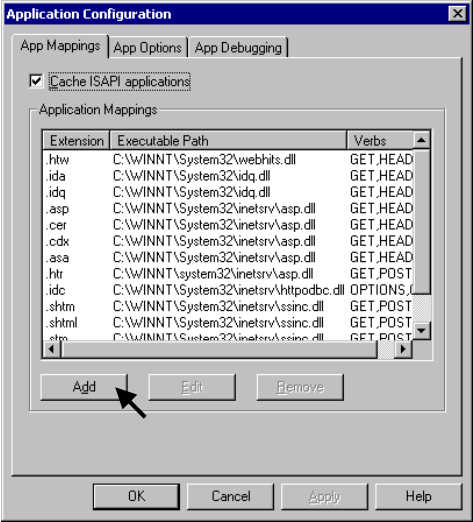

5.2.14. Digite o caminho do arquivo “**php-cgi.exe**” no campo Executable e “**.php**” em Extension.

 

5.2.15. Clique em **OK** para salvar as configurações. 

 

5.2.16. Confirme se a extensão foi instalada corretamente e clique em **OK**.

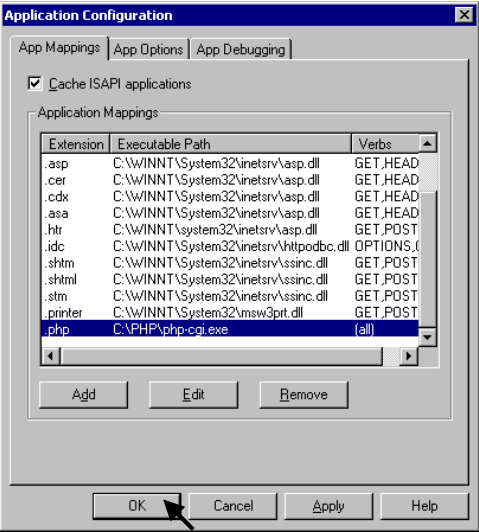 

5.2.17. Na guia **Documents**, clique em **Add**. 

 

5.2.18. Adicione **“stcpweblogin.php”** como a página inicial padrão do novo site que foi criado.

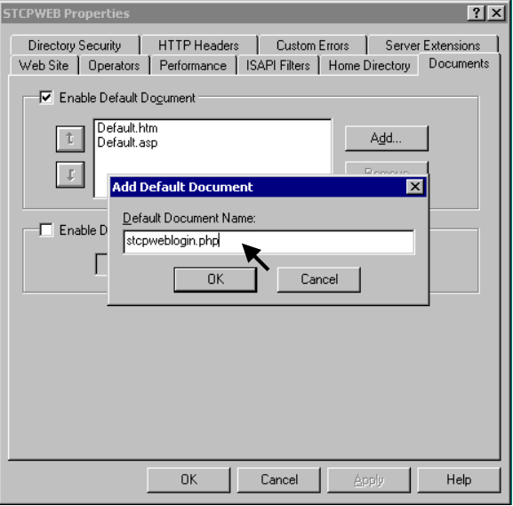 

5.2.19. Com o botão direito do mouse, clique em **STCPWEB → New → Virtual Directory**.

 

5.2.20. A tela de criação do diretório virtual é apresentada. Clique em **Next** para prosseguir.

 

5.2.21. Digite **“stcpweb”** como o novo nome para o diretório virtual.

 

5.2.22. Procure o diretório **“C:\Inetpub\wwwroot\STCPWEB_ADMIN\www”**, onde será publicado o Web Site.

 

5.2.23. Marque as seguintes opções: 

 

5.2.24. Clique em **Finish** para finalizar a criação do diretório virtual.

 

5.2.25. A configuração do Riversoft STCP OFTP Web Admin no IIS 5 foi concluída com sucesso. 

 

### 5.3. Configuração do Riversoft STCP OFTP Web Admin no IIS 6 

5.3.1. Acesse a ferramenta de gerenciamento e administração do Internet Information Services (IIS) para criar o site do Riversoft STCP OFTP Web Admin. 

 

5.3.2. Adicione uma Extension para o PHP, clicando com o botão direito do mouse em “Web Service Extension” e selecione **“Add a new Web service extension”**. 

 

5.3.3. Digite **“PHP”** como o nome da nova extensão Web service:

 

5.3.4. Procure o diretório de instalação do arquivo **“php-cgi.exe”**, ou digite o caminho:

 

5.3.5. Marque a opção **“Set extension status to Allowed”** e clique em **OK**.

 

5.3.6. Crie o novo site para o Riversoft STCP OFTP Web Admin.

 

5.3.7. Verifique com o Administrador da Rede as configurações corretas para este passo e clique em **Next** para prosseguir.

5.3.8. Procure o diretório onde o novo Web Site será criado, ou digite o caminho. Caso este não exista, ele deverá ser criado previamente.

 

5.3.9. Clique em **Next** para prosseguir.

 

5.3.10. Marque as seguintes opções: 

5.3.11. Adicione **“stcpweblogin.php”** como a página inicial padrão do novo site que foi criado.

 

5.3.12. Na guia **Home Directory**, selecione as opções mostradas abaixo.

 

5.3.13. Clique em **Configuration** para prosseguir.

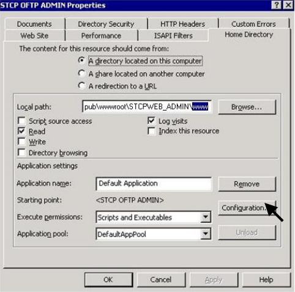 

5.3.14. Digite o caminho do arquivo **“php-cgi.exe”** no campo Executable e **“.php”** em Extension.

 

5.3.15. Com o botão direito do mouse clique em **STCPWEB → New → Virtual Directory**.

 

5.3.16. Digite “stcpweb” como o nome do diretório. 

 

5.3.17. Procure o diretório onde o Web Site será publicado, ou digite o caminho.

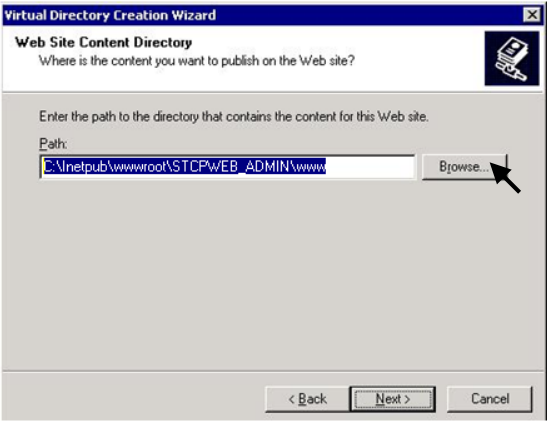 

5.3.18. Configure as permissões de acesso para o usuário **“Internet Guest Account (IUSR)”** nos diretórios abaixo relacionados:

Diretório| Permissões
:---     | :---
C:\php   | Leitura /Execução
C:\php\sessiondata| Leitura /Gravação
C:\Inetpub\wwwroot\STCPWEB_ADMIN\www| Leitura /Gravação /Modificação
%SYSTEMROOT%\CMD.EXE| Leitura /Execução
C:\Inetpub\wwwroot\STCPWEB_ADMIN\conf| Leitura /Gravação /Modificação

### 5.4. Acesso ao Riversoft STCP OFTP Web Admin

5.4.1. Pelo seu navegador, entre com o endereço do Riversoft STCP OFTP Web
Admin.

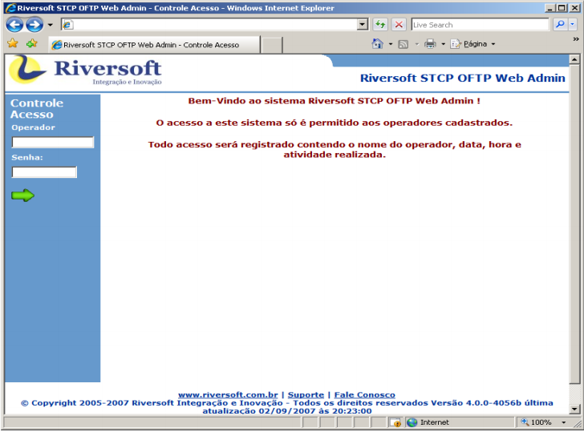 

5.4.2. Digite “stcpadmin” no campo operador e “teste” em senha.

Obs.: para o primeiro login na ferramenta, qualquer nome de operador e senha serão aceitos, já que não existe nenhum operador cadastrado.

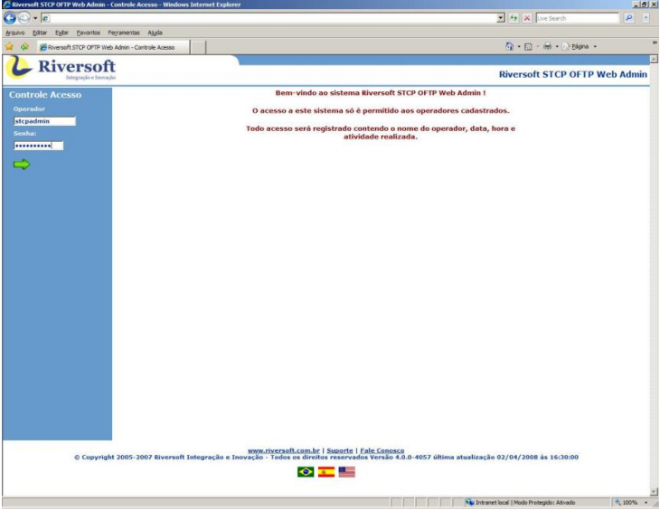 

### 5.5. Cadastro de Administrador do sistema

5.5.1. Acesse **Manutenção → Cadastro → Operadores**.

5.5.2. Clique no botão "+".

 

5.5.3. Cadastre o administrador do sistema.

Obs.: o administrador do sistema deverá ser obrigatoriamente o **“stcpadmin”**. Este operador não terá restrições de acesso e poderá gerenciar todos os outros operadores.

 

5.5.4. Clique no botão para salvar as informações do administrador do sistema.

5.5.5. Clique em **Sair** para acessar o sistema com o novo nome de operador e a nova senha.

 

### 5.6. Criação de Grupos

5.6.1. Adicione grupos acessando **Manutenção → Cadastro → Grupos**. 
5.6.2. Clique no botão "+". 

 

5.6.3. Preencha os campos: nome, descrição e servidor/usuário.

Obs.: para associar todos os servidores a todos os usuários, utilize **“*\ *”**. Para especificar os usuários relacionados ao servidor, basta separar com uma barra invertida \ . Exemplo: **SERV001\USER001**.

5.6.4. Selecione os operadores e as permissões que farão parte do grupo.

 

5.6.5. Clique no botão para salvar as informações do grupo.

### 5.7. Cadastro de Operadores 

5.7.1. Agora cadastre os operadores que farão parte dos grupos criados.

5.7.2. Acesse **Manutenção → Cadastro → Operadores**.

5.7.3. Clique no botão "+".

 

5.7.4. Adicione os operadores, incluindo-os nos grupos adequados.

 

5.7.5. Clique no botão para salvar as informações do operador.

### 5.8. Cadastro dos Servidores 

5.8.1. Adicione grupos acessando **Manutenção → Cadastro → Servidores**.

5.8.2. Clique no botão "+".

 

5.8.3. Adicione as informações do servidor.

Obs.: este servidor refere-se ao servidor de monitoração definido no STCP OFTP Server.

 

5.8.4. Clique no botão para salvar as informações do servidor. 

------------
## **6. Funcionalidades** 

### 6.1 Consulta aos Agendamentos 

Esta funcionalidade permite ao usuário consultar os agendamentos na ferramenta STCP OFTP Server Enterprise.

6.1.1. Acesse **Consultas → Cadastro → Agendamentos**.

6.1.2. Informe o nome completo do agendamento no campo “Nome do Agendamento”. Para filtrar os dados da pesquisa, informe também a descrição do agendamento.

6.1.3. Ou clique no botão para visualizar todos os agendamentos.

 

### 6.2. Consulta aos Códigos de erros

Esta funcionalidade permite ao usuário consultar os códigos de erros.

6.2.1. Acesse **Consultas → Cadastro → Códigos de erros**.

6.2.2. Informe o “Código de erro”. Para filtrar os dados da pesquisa, informe também
a descrição do erro.

6.2.3. Ou clique no botão para visualizar todos os códigos de erros.

 

### 6.3. Consulta aos Códigos de eventos

Esta funcionalidade permite ao usuário consultar os códigos de eventos.

6.3.1. Acesse **Consultas → Cadastro → Códigos de eventos**.

6.3.2. Informe o “Código do evento”. Para filtrar os dados da pesquisa, informe
também a descrição do evento.

6.3.3. Ou clique no botão para visualizar todos os códigos de eventos.

 

### 6.4. Consulta aos Grupos

Esta funcionalidade permite ao usuário consultar os Grupos.

6.4.1. Acesse **Consultas → Cadastro → Grupos**.

6.4.2. Informe o “Grupo”. Para filtrar os dados da pesquisa, informe também a descrição do grupo.

6.4.3. Ou clique no botão para visualizar todos os grupos cadastrados.

 

### 6.5. Consulta aos Operadores

Esta funcionalidade permite ao usuário consultar os Operadores.

6.5.1. Acesse **Consultas → Cadastro → Operadores**.

6.5.2. Informe o “Operador”. Para filtrar os dados da pesquisa, informe também a
descrição do operador.

6.5.3. Ou clique no botão para visualizar todos os operadores cadastrados.

 

### 6.6. Consulta aos Usuários

Esta funcionalidade permite ao usuário consultar os Usuários cadastrados.

6.6.1. Acesse **Consultas → Cadastro → Usuários**.

6.6.2. Informe a “Identificação do usuário”. Para filtrar os dados da pesquisa, informe
também a descrição do usuário.

6.6.3. Ou clique no botão para visualizar todos os usuários cadastrados.

 

### 6.7. Histórico das Transferências

Esta funcionalidade permite ao usuário consultar o Histórico das Transferências.

6.7.1. Para consultar o histórico das transferências, acesse **Consultas → Transferências → Histórico**.

6.7.2. Informe a “Identificação do usuário” e o “Nome do arquivo”.

6.7.3. Selecione o “Período considerado” e a “Situação” (Todas, Recebidas/OK, Enviadas/OK, Falha Rx ou Falha Tx).

6.7.4. Ou clique no botão para visualizar todo o histórico das transferências.

 

### 6.8. Transferências Pendentes

Esta funcionalidade permite ao usuário consultar as Transferências Pendentes.

6.8.1. Acesse **Consultas → Transferências → Pendentes**.

6.8.2. Informe o Usuário. Para filtrar os dados da pesquisa, informe também a descrição do usuário.

6.8.3. Selecione o “Período considerado” e a “Situação” (Pend envio, Pend conf, Pend restart ou Pend tratamento).

6.8.4. Ou clique no botão para visualizar todas as transferências pendentes.

 

### 6.9. Relatório de Eventos de Operadores

Esta funcionalidade permite ao usuário consultar o relatório de eventos de operadores organizados por Data/Hora ou pelo operador, em ordem crescente. Os eventos listados no relatório são referentes ao início/fim de sessão, alteração de parâmetros e demais ações realizadas pelos operadores no STCP OFTP Web Admin.

6.9.1. Acesse **Relatórios → Eventos → Operadores**.

6.9.2. Informe a “Identificação do Operador”. Para pesquisa avançada, digite no campo “Pesquisa Avançada” parte do texto do arquivo.

6.9.3. Selecione o “Período considerado”, e DataHora ou Operador em “Ordenado por”.

 

6.9.4. Ou clique no botão para visualizar todos os eventos.  

 

### 6.10. Relatório de Eventos do Sistema

Esta funcionalidade permite ao usuário consultar o relatório de eventos do Sistema organizado por Data/Hora ou módulo, em ordem crescente. Os eventos listados no relatório podem ser: início/fim do serviço STCP OFTP, início/fim de conexões entrantes ou saintes, início e término da agenda, início e término de transmissão e recepção de arquivos, erros do sistema/transferência etc.

6.10.1. Acesse **Relatórios → Eventos → Sistema**.

6.10.2. Informe a “Identificação do Módulo". Para pesquisa avançada, digite no campo “Pesquisa Avançada” o módulo do sistema onde ocorreu o evento. Exemplo: STCP, STCPMON, STCPCONF, etc.

6.10.3. Selecione o “Período considerado”, e DataHora ou Módulo em “Ordenado por”.

 

6.10.4. Ou clique no botão para visualizar todos os eventos. 

 

### 6.11. Relatório de Eventos dos Usuários

Esta funcionalidade permite ao usuário consultar o relatório de eventos dos usuários organizados por Data/Hora ou usuário, em ordem crescente. Os eventos listados no relatório podem ser: início/fim de conexões entrantes ou saintes, início e término de transmissão e recepção de arquivos, erros na transferência do usuário, dentre outros.

6.11.1. Acesse **Relatórios → Eventos → Usuários (Caixa Postal)**.

6.11.2. Informe a “Identificação do Usuário”. Para pesquisa avançada, digite no campo
“Pesquisa Avançada” parte do texto do arquivo.

6.11.3. Selecione o “Período considerado”, e DataHora ou Usuário em “Ordenado por”.

 

6.11.4. Ou clique no botão para visualizar todos os eventos. 

 

### 6.12. Relatório - Auditoria das transferências

Esta funcionalidade permite ao usuário consultar o relatório das transferências organizado por Data/Hora ou usuário, em ordem crescente.

6.12.1. Acesse Relatórios → Transferências → Auditoria.

6.12.2. Informe a “Identificação do Usuário”. Para pesquisa avançada, digite no campo “Pesquisa Avançada” parte do texto do arquivo.

6.12.3. Selecione o “Período considerado”, e DataHora ou Usuário em “Ordenado por”.

 

6.12.4. Ou clique no botão para visualizar a auditoria de todas as transferências. 

 

### 6.13. Relatório - Estatísticas das transferências

Esta funcionalidade permite ao usuário consultar o relatório de estatística das transferências organizado por tipo.

6.13.1. Acesse **Relatórios → Transferências → Estatísticas**.

6.13.2. Informe a “Identificação do usuário”. Para filtrar os dados da pesquisa, informe o “Nome do arquivo”.

6.13.3. Selecione o “Período considerado”, e o “Tipo” de relatório (consolidado, anual, mensal, semanal, dia da semana, Diário ou por hora). 

 

6.13.4. Ou clique no botão para visualizar a estatística de todas as transferências.

 

### 6.14. Relatório - Gráficos das transferências

Esta funcionalidade permite ao usuário visualizar o gráfico das transferências organizado por tipo.

6.14.1. Acesse **Relatórios → Transferências → Gráficos**.

6.14.2. Informe a “Identificação do usuário”. Para filtrar os dados da pesquisa, informe o “Nome do arquivo”.

6.14.3. Selecione o “Período considerado”, e o “Tipo” de relatório (consolidado, anual, mensal, semanal, dia da semana, Diário ou por hora).

6.14.4. Escolha a forma como será apresentado o gráfico.

6.14.5. Ou clique no botão para visualizar o gráfico de todas as transferências.

 

### 6.15. Relatório – Roteamentos

6.15.1. Acesse **Relatórios → Roteamentos → Auditoria**.

6.15.2. A pesquisa pode ser feita informando a “Identificação da origem”, por exemplo, que é o nome de usuário.  

Exemplo: O005RIVERSOFT.

 

6.15.3. Ou infome a “Identificação do destino”.

Exemplo: SRSVM-T02.

 

6.15.4. Para visualizar todos os relatórios, clique no botão. 

 

### 6.16. Importação de códigos de erros

6.16.1. Para importar os códigos de erros de um arquivo xml para o banco de dados do STCP OFTP Web Admin, acesse **Manutenção → Banco de Dados → Importar Dados**. 

 

6.16.2. Em **Tipo de Dados**, escolha a opção **Códigos de Erros** e clique no botão. 

 

6.16.3. Selecione o arquivo encontrado e clique no botão. 

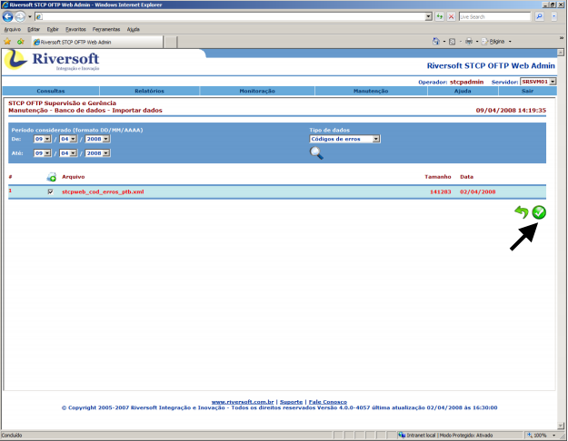 

6.16.4. Quando o processo de importação for concluído, será mostrada a confirmação. 

 

### 6.17. Importação de códigos de eventos

6.17.1. Para importar os códigos de eventos de um arquivo xml para o banco de dados da STCP OFTP Web Admin, acesse **Manutenção → Banco de Dados → Importar Dados**.

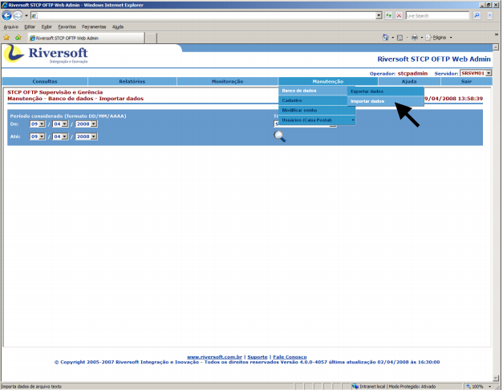 

6.17.2. Em Tipo de Dados, escolha a opção Códigos de Eventos e clique no botão.

 

6.17.3. Selecione o arquivo encontrado e clique no botão.

 

6.17.4. Quando o processo de importação for concluído, será mostrada a confirmação. 

### 6.18. Exportação de códigos de erros

6.18.1. Para exportar os códigos de erros da base de dados do STCP OFTP Web Admin para um arquivo xml, acesse **Manutenção → Banco de Dados → Exportar Dados**.

 

6.18.2. Em **Tipo de Dados**, escolha a opção **Códigos de Erros** e clique no botão.

 

6.18.3. Para realizar a exportação dos dados, clique no botão. 

 

6.18.4. Quando o processo de exportação for concluído, será mostrada a confirmação. 

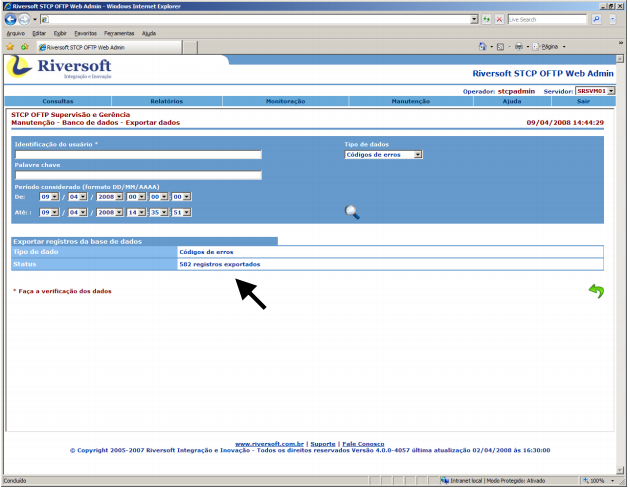 

### 6.19. Exportação de códigos de eventos

6.19.1. Para exportar os códigos de eventos da base de dados do STCP OFTP Web Admin para um arquivo xml, acesse **Manutenção → Banco de Dados → Exportar Dados**.

 

6.19.2. Em Tipo de Dados, escolha a opção Códigos de Eventos e clique no botão.

6.19.3. Para realizar a exportação dos dados, clique no botão.

 

6.19.4. Quando o processo de exportação for concluído, será mostrada a confirmação. 

 

### 6.20. Cadastro de códigos de erros

6.20.1. Para cadastrar um código de erro, acesse **Manutenção → Cadastro → Códigos de erros**.

6.20.2. Clique no botão "+".

 

6.20.3. Preencha os campos: **código, descrição** e **procedimento**.

6.20.4. Selecione a classificação do erro no campo **Classe**. 

 

6.20.5. Clique no botão para salvar as informações do código de erro.

### 6.21. Cadastro de códigos de eventos

6.21.1. Para cadastrar um código de evento, acesse **Manutenção → Cadastro → Códigos de eventos**.

6.21.2. Clique no botão.

 

6.21.3. Preencha os campos: **código, descrição e procedimento**.  

 

6.21.4. Clique no botão para salvar as informações do código de evento. 

### 6.22. Modificar senha de operador

6.22.1. Para modificar a senha do operador do STCP OFTP Web Admin, acesse **Manutenção → Modificar senha**.

Obs.: este procedimento modifica a senha do operador que está logado na ferramenta.

 

6.22.2. Preencha os campos: **senha atual, nova senha** e **confirma**. 

 

6.22.3. Clique no botão para salvar a nova senha. 

### 6.23. Limpeza de diretório de Usuários (Caixa Postal)

6.23.1. Para realizar a limpeza de diretório de uma caixa postal do STCP OFTP Server, acesse **Manutenção → Usuários (Caixa Postal) → Limpar diretório**.

 

6.23.2. Preencha os campos:

* Identificação do usuário = nome da caixa postal.  
* Nome do arquivo = nome do arquivo que deseja buscar. Caso queira ver todos os arquivos, deixe este campo em branco.  
* Período considerado = refere-se à data de criação do arquivo dentro do diretório especificado.  
* Diretório = selecione o diretório onde deseja fazer a limpeza. As opções disponíveis
são: _backup, pendente de envio, pendente de confirmação, recebidos, pendente de
restart_.  

6.23.3. Clique no botão para realizar a pesquisa no diretório.  

 

6.23.4. Selecione os arquivos que deseja remover e clique no botão. 

 

6.23.5. Quando o processo de limpeza for concluído, será mostrada a confirmação. 

 

### 6.24. Recuperar transferência de Usuários (Caixa Postal)

6.24.1. Para recuperar uma transferência de uma caixa postal do STCP OFTP Server, acesse **Manutenção → Usuários (Caixa Postal) → Recuperar transferência**.

Obs.: este procedimento recupera uma transferência do diretório **Backup** e coloca no diretório **Saída** da caixa postal.

 

6.24.2. Preencha os campos:

* Identificação do usuário = nome da caixa postal.  
* Nome do arquivo = nome completo do arquivo que deseja recuperar.  
* Período considerado = refere-se à data de criação do arquivo dentro do diretório de backup.  

6.24.3. Clique no botão para buscar o arquivo. 

 

6.24.4. Selecione o arquivo e clique no botão. 

 

6.24.5. Quando o processo de recuperação for concluído, será mostrada a confirmação. 

 

### 6.25. Resetar senha de Usuários (Caixa Postal)

6.25.1. Para resetar a senha de uma caixa postal do STCP OFTP Server, acesse **Manutenção → Usuários (Caixa Postal) → Resetar senha**.  

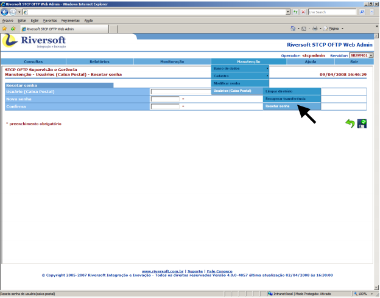

6.25.2. Preencha os campos: **usuário (caixa postal), nova senha** e **confirma**. 

 

6.25.3. Clique no botão para salvar a nova senha da caixa postal. 

### 6.26. Executar agendamento do STCP OFTP Server 

6.26.1. Para executar um agendamento do STCP OFTP Server, acesse **Monitoração → Agendamentos → Executar.** 

 

6.26.2. Preencha os campos:

* **Agendamento** = nome do agendamento que deseja buscar. Caso queira ver todos os agendamentos, deixe este campo em branco.    
* **Descrição** = descrição do agendamento. Use este campo para filtrar os agendamentos pela descrição.  

6.26.3. Clique no botão para buscar o agendamento. 

 

6.26.4. Clique sobre o nome do agendamento para executá-lo.  

6.26.5. Será aberta uma nova janela informando o resultado da execução do agendamento.

Obs.: se o agendamento estiver desabilitado, não será possível executá-lo.

### 6.27. Alterar estado de agendamento do STCP OFTP Server 

6.27.1. Para alterar o estado de um agendamento do STCP OFTP Server, acesse **Monitoração → Agendamentos → Alterar estado**. 

Obs.: este procedimento permite que um agendamento seja bloqueado/desbloqueado. 

 

6.27.2. Preencha os campos: 

* **Agendamento** = nome do agendamento que deseja buscar. Caso queira ver todos os agendaamentos, deixe este campo em branco.   
* **Descrição** = descrição do agendamento. Use este campo para filtrar os agendamentos pela descrição. 

6.27.3. Clique no botão para buscar o agendamento. 

 

6.27.4. Clique sobre o nome do agendamento para alterar seu estado. 

 

6.27.5. O estado do agendamento é mostrado no lado direito da janela. 

 

### 6.28. Monitorar eventos do servidor 

6.28.1. Para visualizar os eventos do servidor de monitoração do STCP OFTP Server, acesse **Monitoração → Servidor → Eventos**. 

 

* A monitoração do servrdor permite visualizar, em tempo real, todos os eventos¹ da sessão atual do serviço do STCP OFTP. Esta página é atualizada de tempos em tempos.  

-------
¹ Início/fim do serviço STCP OFTP, Início/Fim de conexões entrantes/saintes, Início e Término da agenda, Início e Término de transmissão e recepção de arquivos, Erros do sistema/transferência, dentre outros. 

### 6.29. Monitorar transferências 

6.29.1. Para monitorar as transferências em andamento, acesse **Monitoração → Servidor → Transferências em andamento.** 

 

* As transferências são monitoradas em tempo real e a página é atualizada de tempos em tempos. 

 

### 6.30. Iniciar conexão com usuários (Caixa Postal) 

6.30.1. Para iniciar uma conexão com uma caixa postal do STCP OFTP Server, acesse **Monitoração → Usuários (Caixa Postal) → Iniciar Conexão**. 

Obs.: esta funcionalidade só está disponível para caixas postais que estejam com a conexão automática habilitada. 

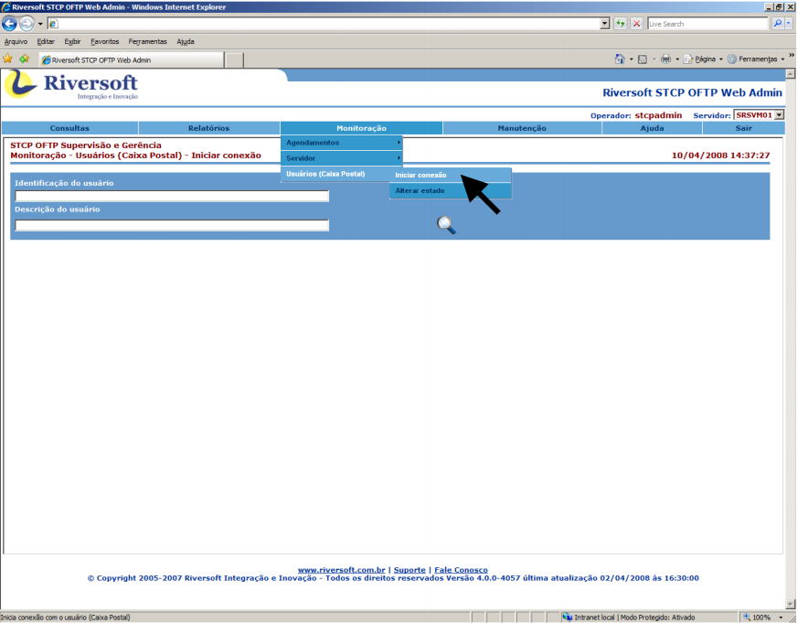 

6.30.2. Preencha os campos: 

* **Identificação do usuário** = nome da caixa postal. Caso queira ver todas as caixas postais, deixe este campo em branco.   
* **Descrição do usuário** = descrição da caixa postal. Use este campos para filtrar as caixas postais pela descrição. 

6.30.3. Clique no botão para realizar a busca.  

6.30.4. Clique sobre o  nome da caixa postal para iniciar a conexão. 

 

6.30.5. Será aberta uma nova janela mostrando o resultado da conexão do usuário. 

 

### 6.31. Alterar estado de usuários (Caixa Postal) 

6.31.1. Para alterar o estado de uma caixa postal do STCP OFTP Server, acesse **Monitoração → Usuários (Caixa Postal) → Alterar estado**. 

Obs.: este procedimento permite que uma caixa postal seja bloqueada/desbloqueada. 

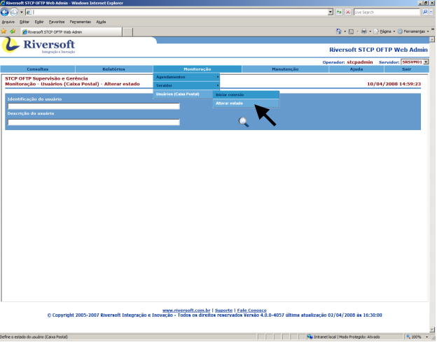 

6.31.2. Preencha os campos: 

* **Identificação do usuário** = nome da caixa postal que deseja buscar. Caso queira ver todas as caixas postais, deixe este campo em branco.   
* **Descrição do usuário** = descrição da caixa postal. Use este campo para filtrar as caixas pela descrição. 

6.31.3. Clique no botão para realizar a busca. 

 

6.31.4. Clique sobre o noem da caixa postal para alterar seu estado.  

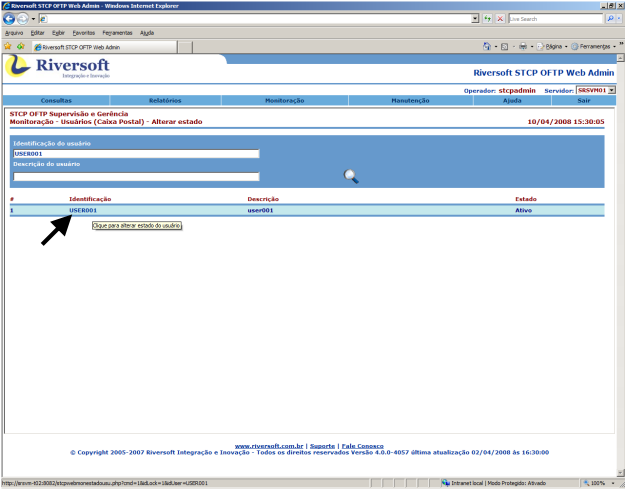 

6.31.5. O estado da caixa postal é mostrado no lado direito da janela. 

 

--------
## **7. Mensagens do Sistema** 

Mensagem | Procedimento
:---     | :---
**[E0008] sessão expirada por inatividade**| Clique no botão “Voltar” e entre no sistema com o nome do operador e a senha.
**Operador ou senha inválida**| Tente novamente.

---------
## **8. Glossário** 

**I** 

**IUSR**    
Conta Interna para acesso anônimo ao Internet Information Service. 

**S**   

**System DSN**    
Pode ser usado por alguém que tenha acesso à máquina. 

------
## **9. Referências**  

Disponível em: (<http://www.webopedia.com/TERM/D/DNS.html>).

Acesso em: 16 de agosto de 2007.